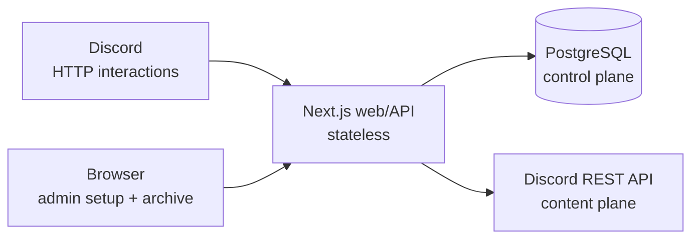

# Clip

**An authorized Discord member deliberately preserves one message into a server-owned archive — with roughly the effort of pinning it.**

Discord keeps the archived content. Clip's database keeps only the control state needed to operate the archive correctly.

> **Status: pre-implementation.** As of this commit the repository contains the approved product specification, implementation plan, design system and screen designs. No application code has been written. Nothing in this document describes working software yet; sections marked _(pending)_ will be filled with real evidence as it is produced. See [docs/04_ASSIGNMENT_CUMULATIVE_SNAPSHOT.md](docs/04_ASSIGNMENT_CUMULATIVE_SNAPSHOT.md) for the running evidence log.

---

## The problem

Discord pins are a bounded, channel-local shortlist managed through moderation permissions. The current limit is 250 pins per channel. The motivating incident was concrete: a community had to delete historical pins to make room for new ones.

But pin count is the symptom. The real gap is that communities have no low-friction primitive for saying:

> *"This message is worth preserving for us."*

## Positioning

Clip is not an unlimited-pin utility and not a Starboard. Each neighboring primitive already means something specific:

| Primitive | What it means |
|---|---|
| Discord Pin | A moderator says this is important **for this channel** |
| Personal bookmark | An individual says **I** want this later |
| Starboard | **Enough people** liked this |
| Pin archiver | These were **already pinned** and overflowed |
| Bulk logger/exporter | **Capture everything**, filter later |
| **Clip** | **An authorized member says this is worth preserving for the community** |

The niche is *shared intentional memory*: one visible message, preserved on purpose, without first pinning it, without a popularity threshold, and without bulk-ingesting the conversation.

## Core loop

```
Admin runs /setup in Discord
  → ephemeral one-time link (15 min)
  → web: choose archive channel + roles
  → done

Member right-clicks a message → Apps → Clip
  → provenance + forwarded snapshot posted to the archive channel
  → 📎 marker added to the source message
  → author receives a best-effort DM with a "remove" action

Author or admin → Apps → Remove from Clip Archive
  → archive deleted, tombstone retained, recreation blocked
```

## Architecture

A single stateless Next.js deployable serves both the Discord interaction endpoint and the admin web UI. There is no persistent Gateway worker in P0 — every product input is an explicit command or button, which HTTP interactions deliver.



### The ownership boundary

This is the central architectural decision:

| Discord is authoritative for | PostgreSQL is authoritative for |
|---|---|
| Archived message body | Guild configuration and allowed roles |
| Embeds, attachments, media | Clip identity and state machine |
| Snapshot rendering | Per-user preservation signals |
| User/channel display details | Author/admin removal tombstones |
| | Notification and idempotency state |
| | Admin setup tokens and sessions |

Clip **does not** persist raw message bodies, attachment binaries, embed payloads, avatars, a search corpus, or embeddings. The web archive fetches content live from Discord at render time.

Deleting Clip's data for a guild deletes Clip's control state and leaves the Discord archive channel and every message in it untouched. Our service data disappearing must never destroy community-owned content.

## P0 scope

**In**, because the service cannot operate correctly without it: admin setup and archive destination; role-gated clipping; exactly one selected message per clip; canonical deduplication with multiple preservation signals; unclip; author/admin removal with durable tombstones; concurrency and idempotency invariants; private archive by default; best-effort author DM plus a source marker; a minimal Postgres control plane; a read-only admin web archive; and real deployment.

**Deferred**, with reasons, in [docs/01_CLIP_PRODUCT_SPEC.md §21](docs/01_CLIP_PRODUCT_SPEC.md) and the ledger in [docs/03_CLIP_RESEARCH_DECISION_LOG.md §10](docs/03_CLIP_RESEARCH_DECISION_LOG.md): AI summarization, publishing/print, full-text search, tags and collections, thread/parent clipping, reaction-driven clipping, preemptive opt-out, per-channel denylists, permission-aware routing, member OAuth, content caching, a Gateway worker, and automated reconciliation.

The cuts are part of the answer, not gaps to hide.

## Discord permissions

Clip never requests `Administrator`.

| Permission | Why | When |
|---|---|---|
| `VIEW_CHANNEL` on source channels | Discord refuses to forward a message the application cannot read (error `160014`) | Steady state |
| `VIEW_CHANNEL` + `SEND_MESSAGES` on the archive channel | Post provenance and the forwarded snapshot | Steady state |
| `MANAGE_MESSAGES` on the archive channel | Delete an archive entry on unclip or removal | Steady state |
| `ADD_REACTIONS` | The bot-owned 📎 marker on the source message | Steady state |
| `MANAGE_CHANNELS` | Only to auto-create the private archive channel | Bootstrap only — revocable afterwards |

_(pending)_ The exact minimum set must be validated against a fresh test guild and this table replaced with the measured result.

## Privacy and data behavior

- Clipping is restricted to guild admins and explicitly configured roles
- A newly created archive is private by default
- Only human-selected messages are touched; there is no bulk monitoring
- Message content is never copied into Clip's database
- The original author is notified on first archival and can remove their own archived message, independently of whether the DM was delivered
- Removal leaves a tombstone that blocks immediate recreation, so an author cannot be re-clipped in a loop
- Operational logs record identifiers and state transitions, never message bodies or attachments

We do not claim to store no user data. Clip stores Discord IDs, role configuration, preservation signals and operational metadata.

## Known limitations

- **The 📎 marker count is not a metric.** Users can add the same reaction; Clip ignores those. The count is never surfaced in the web UI, and removing an archive cannot remove reactions other users added.
- **Forwarding constrains what can be clipped.** Discord only forwards `DEFAULT`, `REPLY`, `CHAT_INPUT_COMMAND` and `CONTEXT_MENU_COMMAND` messages — polls, calls and system messages are rejected as invalid targets.
- **A forward cannot carry its own provenance.** Discord rejects `content` sent alongside a forward (error `160011`) and omits `author` from the snapshot, so each archive entry is two messages: a provenance line, then the forward.
- **Snapshots are immutable.** Editing the original does not update the archive; deleting the original does not delete the archive.
- **The archive can drift.** If someone manually deletes an archive message in Discord, the record survives and the web UI shows a `누락` state. Automated reconciliation is P1.
- **The web archive is admin-only** and gated on a short-lived session; there is no member-facing login in P0.

## Deployment

Self-hosted on an existing home k3s cluster (Intel N100, 16 GB) behind Traefik, against an existing PostgreSQL cluster. Deployment is P0 work and happens before the product is built, not after — the Discord interaction endpoint has to be verified against real HTTPS early.

Self-hosting is not free. The honest accounting:

| Cost | Amount | Note |
|---|---|---|
| Domain `clipendpoint.cc` | **USD 8 / year** | Registered via Cloudflare. The one genuinely new recurring cost. |
| Incremental compute | ~0 marginal | Absorbed by an existing cluster running at ~1.6 load and ~5% memory. Not free — merely already paid for. |
| Electricity, network, hardware depreciation | not itemized | Real costs the household absorbs. Treated as sunk for this project rather than claimed as zero. |
| Operator effort | not itemized | The largest real cost of self-hosting, and the one most often omitted. |

_(pending)_ Observed resource usage replaces the request figures once deployed.

## Development

Requires Node 24+, pnpm, Docker, and access to a PostgreSQL instance.

```bash
pnpm install
cp .env.example .env      # fill in Discord credentials and DATABASE_URL
pnpm prisma migrate dev
pnpm dev
```

_(pending)_ Full setup, command registration and deployment instructions land with the implementation.

## AI-assisted development method

This project is built with Claude Code as the primary implementer, with product and architecture judgment held by the human. The working pattern, and the evidence for it, is recorded continuously rather than reconstructed at the end:

- Product semantics were frozen in a specification **before** any code generation, so implementation agents optimize the build rather than the product
- Every wave is planned as atomic tasks with an explicit dependency graph — see [docs/tasks/](docs/tasks/)
- Technical notes, dead ends and parked issues go to [docs/journal/](docs/journal/)
- Assignment evidence — what the AI proposed, what was accepted, what was rejected and why, how it was verified — is appended to [docs/04_ASSIGNMENT_CUMULATIVE_SNAPSHOT.md](docs/04_ASSIGNMENT_CUMULATIVE_SNAPSHOT.md)

Failures are recorded when they happen, not summarized afterwards. The first one is already in the log: the plan specified an archive format that Discord's API rejects.

## Repository map

| Path | Contents |
|---|---|
| [docs/00_HANDOFF_INDEX.md](docs/00_HANDOFF_INDEX.md) | Entry point to the planning package and read order by role |
| [docs/01_CLIP_PRODUCT_SPEC.md](docs/01_CLIP_PRODUCT_SPEC.md) | Approved product behavior, data model, invariants, failure cases |
| [docs/02_CLIP_IMPLEMENTATION_PLAN.md](docs/02_CLIP_IMPLEMENTATION_PLAN.md) | Waves, tasks, tests, verification gates |
| [docs/03_CLIP_RESEARCH_DECISION_LOG.md](docs/03_CLIP_RESEARCH_DECISION_LOG.md) | Why Clip, competitor attacks, rejected alternatives, reversals |
| [docs/04_ASSIGNMENT_CUMULATIVE_SNAPSHOT.md](docs/04_ASSIGNMENT_CUMULATIVE_SNAPSHOT.md) | Append-only evidence log |
| [docs/05_DESIGN_AGENT_BRIEF.md](docs/05_DESIGN_AGENT_BRIEF.md) | Functional screens and UX invariants given to the design pass |
| [docs/06_DESIGN_HANDOFF.md](docs/06_DESIGN_HANDOFF.md) | **The UI specification** — design system, screens A–E, final Korean copy |
| [docs/DESIGN_RATIONALE_APPEND.md](docs/DESIGN_RATIONALE_APPEND.md) | Design decision log (Korean) |
| [docs/tasks/](docs/tasks/) | Per-task implementation briefs and the dependency graph |
| [docs/journal/](docs/journal/) | Technical notes and dead ends |
| [design/](design/) | Design reference prototypes — **not code**, never imported or served |
| [tokens.css](tokens.css) | The single source of visual values |

## License

Not yet determined.
