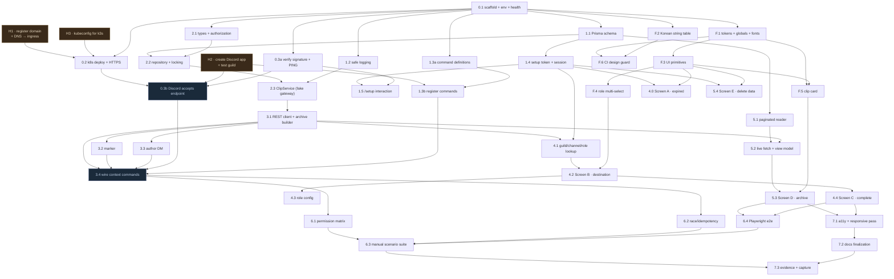

# Clip P0 — task dependency graph

Task detail lives in **GitHub issues** (`cgm-16/clip`), one issue per node below. This file is the
map: what blocks what, what can run in parallel, and where the critical path is. Issues carry the
implementer brief; this file carries the ordering. Keeping detail in one place stops the two from
drifting.

**Deadline: 2026-08-20 23:59 KST.**

---

## One change to the plan's ordering

`02_CLIP_IMPLEMENTATION_PLAN.md` puts the design system in **Wave 7**, after the UI is built in
Waves 4–5. That sequencing was written when no design existed. It now does: `tokens.css` and
`06_DESIGN_HANDOFF.md` fully specify the system down to hex values and Korean copy.

Building Screens B–E against ad-hoc styles and restyling them afterwards is pure rework. The design
system therefore moves **before** the screens, as a foundation wave (`F.*`) that has no dependency
on Discord or deployment and can start immediately. Wave 7 keeps only what genuinely comes last:
the accessibility/responsive verification pass and submission evidence.

---

## Graph



---

## Critical path

```
H2 ─┐
    ├→ 0.1 → 1.1 → 2.2 → 2.3 → 3.1 → 3.4 → 6.2 → 6.3 → 7.3
H1 ─┴→ 0.2 → 0.3b ─────────────────────↗
```

Nine tasks deep. The domain chain (`1.1 → 2.2 → 2.3 → 3.1`) is the longest stretch of pure
implementation work and is where a slip costs most — it has no parallel alternative and everything
in Waves 3–6 sits behind it.

**Two hard gates.** Nothing downstream is real until each passes:

| Gate | Meaning |
|---|---|
| `0.3b` | Discord accepts the interaction endpoint URL. Until this passes, deployment is unproven. |
| `3.4` | The Discord-only happy path works end to end in a real guild, even with no web UI. |

---

## What is blocked on Ori, and what is not

Three prep tasks are human-only and sit at the head of the graph:

| | Task | Blocks |
|---|---|---|
| **H1** | Register a domain, point DNS at the k3s ingress | `0.2`, then `0.3b` |
| **H2** | Create the Discord application + a test guild; hand over `APPLICATION_ID`, `PUBLIC_KEY`, `BOT_TOKEN` | `0.3b`, `1.3b`, all of Wave 3–4 |
| **H3** | Provide a kubeconfig (or apply manifests manually) | `0.2` |

**None of them block the start of work.** Everything below is reachable with zero external
dependencies, and it is most of the codebase:

```
0.1  scaffold            1.1  schema           2.1  types + authorization
1.2  safe logging        1.3a command defs     2.2  repository + locking
F.1  tokens + globals    F.2  string table     2.3  ClipService (fake gateway)
F.3  UI primitives       F.4  role select      5.1  paginated reader
F.5  clip card           F.6  CI design guard
```

That is Waves 1, 2 and the whole UI foundation. Postgres work runs against a local Docker
container, so `H3` does not gate it either. If the human tasks land late, the schedule absorbs it.

---

## Parallel tracks

Three tracks run concurrently after `0.1`. They only converge at Wave 4–5.

| Track | Tasks | Converges at |
|---|---|---|
| **Domain** | `1.1 → 2.2 → 2.3 → 3.1 → 3.2/3.3 → 3.4` | `3.4` |
| **UI foundation** | `F.1 → F.3 → F.4/F.5`, `F.2` | `4.2`, `5.3` |
| **Infra** | `0.2 → 0.3b`, `1.3b`, CI | `3.4` |

`1.4 → 1.5` (admin session) and `5.1` are small and can be slotted into whichever track has slack.

---

## Wave → PR mapping

One branch and one PR per wave, per the agreed process. Commits stay per-task.

| Wave | Branch | Contains | Merge gate |
|---|---|---|---|
| 0 | `wave/0-deploy-skeleton` | `0.1`, `0.2`, `0.3a`, `0.3b` | Health endpoint live over HTTPS; Discord accepts the endpoint |
| F | `wave/f-ui-foundation` | `F.1`–`F.6` | Primitives render per handoff; focus states and keyboard nav verified |
| 1 | `wave/1-control-plane` | `1.1`–`1.5` | Migration applies; token/session tests pass; `/setup` works in a real guild |
| 2 | `wave/2-clip-domain` | `2.1`–`2.3` | Concurrency tests green against real Postgres |
| 3 | `wave/3-discord-archive` | `3.1`–`3.4` | Clip/Unclip/Remove work end to end in the test guild |
| 4 | `wave/4-admin-setup` | `4.0`–`4.4` | Both destination paths configure successfully |
| 5 | `wave/5-web-archive` | `5.1`–`5.4` | Archive lists, filters, paginates; missing state renders |
| 6 | `wave/6-qa` | `6.1`–`6.4` | Permission matrix recorded; race tests green; 17 manual scenarios evidenced |
| 7 | `wave/7-submission` | `7.1`–`7.3` | A11y pass done; docs and evidence complete |

CI (`pnpm lint`, `pnpm test`, `pnpm build`, and `pnpm lint:design` once `F.6` lands) blocks every
merge. Playwright runs against the deployment, not the merge gate.

**Branches must be up to date with `main` before merging** (`strict` status checks). The three
tracks run in parallel, so a merge on one invalidates open PRs on the others — update the branch
and let CI rerun. The friction is a couple of minutes; a wave PR that was green against a stale
base and breaks `main` mid-sprint costs far more.

---

## If the deadline bites

Cut in this order. Correctness, consent and deployment are never cut.

1. `6.4` Playwright e2e — the manual suite already evidences the same flows
2. `7.1` full a11y sweep — keep focus states and text tags, drop the exhaustive audit
3. `4.3` role configuration UI — ship admin-only clipping, which the spec already allows
4. `5.4` Screen E delete-data UI — the spec requires the capability, not the screen
5. `3.2` marker — explicitly auxiliary in the spec; Clip stays valid without it

Never cut: `2.2` locking, `2.3` state machine, author/admin removal and tombstones, `0.2`/`0.3b`
deployment. Anything cut gets recorded in the snapshot as a deliberate scope decision, not omitted.
